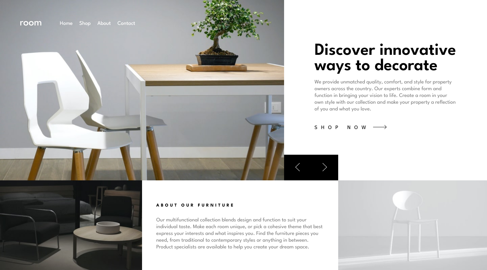

# Frontend Mentor - Room homepage solution

This is a solution to the [Room homepage challenge on Frontend Mentor](https://www.frontendmentor.io/challenges/room-homepage-BtdBY_ENq). Frontend Mentor challenges help you improve your coding skills by building realistic projects. 

## Table of contents

- [Overview](#overview)
  - [Screenshot](#screenshot)
  - [Links](#links)
- [My process](#my-process)
  - [Built with](#built-with)
  - [What I learned](#what-i-learned)
  - [Continued development](#continued-development)
  - [Useful resources](#useful-resources)
- [Author](#author)
- [Acknowledgments](#acknowledgments)

## Overview

### Screenshot




### Links

- Solution URL: [Solution here](https://github.com/MariaCMontO/room-homepage-cmo)

## My process

### Built with

- Semantic HTML5 markup
- CSS custom properties
- Flexbox
- Grid
- JavaScript

### What I learned

With this project, I learned how use sass and BEM on my project. I learned how to use mixins and how to use different files of .scss to divide the work. 

```scss
@mixin container($inline: 3rem, $block: 5rem) {
  padding-inline: $inline;
  padding-block: $block;
}

@mixin titulos($font-size:3.7rem,$weight:600, $line-height:3.5rem, $spacing:0rem,$transform:none) {
  font-size: $font-size;
  font-weight: $weight;
  line-height: $line-height;
  letter-spacing: $spacing;
  text-transform: $transform;
}

@mixin parrafos($font-size:1.58rem) {
  color: gray;
  text-align: left;
  font-size: $font-size;
  line-height: 2rem;
}
```

### Continued development

I definitely want to keep developing interfaces with Sass to make the work easier and more organized.

### Useful resources

## Author

- Frontend Mentor - [@MariaCMontO](https://github.com/MariaCMontO)


## Acknowledgments
